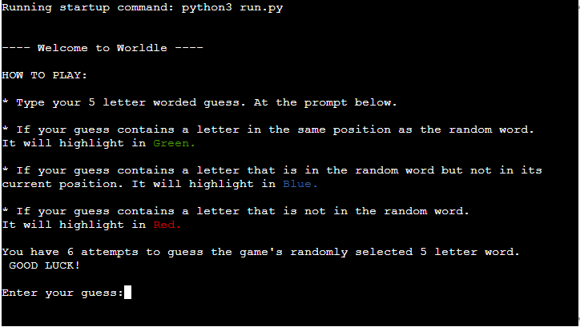

# Wordle

Wordle is a Python command line interface (CLI) application which allows the user to play the well-known game of <a href="https://mashable.com/article/wordle-word-game-what-is-it-explained" target="_blank" rel="noopener">Wordle</a>.

The game was invented by Josh Wardle (Wordle is a pun on his surname) during the Coronavirus lockdown to amuse himself and his wife. It was launched in October 2021 and it is now played by millions worldwide. The rights of the game were sold in January 2022 to the New York Times. <a href="https://www.thesun.ie/tech/8147348/wordle-who-invented/" target="_blank" rel="noopener">Source</a>. 

The game can be enjoyed both by adults and children. To improve their vocabulary and grasp of the English language.

You can play the game here:
[Wordle](https://wordle-challenge-8b5fbd02f69c.herokuapp.com/)

[Back to top](#contents)

# Contents

- [Wordle](#Wordle)
- [Contents](#contents)
- [User Experience (UX)](#user-experience-ux)
  - [User Stories](#user-stories)
    - [Primary Goal](#primary-goal)
    - [Visitor Goals](#visitor-goals)
      - [First Time Visitor](#first-time-visitor)
      - [Returning and Frequent Visitor](#returning-and-frequent-visitor)
  - [Creation Process](#creation-process)
    - [Planning](#planning)
    - [Dependency diagram](#dependency-diagram)
    - [App Structure](#app-structure)
    - [Python Logic](#python-logic)
  - [Design Choices](#design-choices)
    - [Typography](#typography)
    - [Color Scheme](#color-scheme)
- [Features](#features)
    - [Mechanism of the Game](#mechanism-of-the-game)
    - [Winning message](#winning-message)
    - [Future Features](#future-features)
- [Technologies Used](#technologies-used)
- [Python Packages](#python-packages)
- [Testing](#testing)
    - [Manual testing](#manual-testing)
    - [External Testing](#external-testing)
- [Deployment to Heroku](#deployment-to-heroku)
  - [Project Deployment](#project-deployment)
  - [To fork the repository on GitHub](#to-fork-the-repository-on-github)
  - [To create a local clone of a project](#to-create-a-local-clone-of-a-project)
- [Credits](#credits)
  - [Content](#content)
  - [Media](#media)
  - [Acknowledgements](#acknowledgements)

[Back to top](#contents)
# User Experience (UX)

## User Stories

### Primary Goal

The primary goal of this CLI application is to provide a simple game for children and adults to help them develop their mastery and logical skills and to improve their grasp of the English language.

The game features <b>5,757</b> five letter words.

### Visitor Goals
The goal of the game is to guess the randomly selected 5 letter word within 6 attempts.

To aid the user they will be given feedback for each of their guesses.

#### First Time Visitor

  - A user can read the welcome message.
  - A user can find the game rules on the opening screen.
  - A user can expect a visual feedback for warnings, but also for winning the game.
  - A user can expect the number of attempts to be displayed in the winning message.
  - A user can choose to Play again after they have won, or choose to leave the game.

#### Returning and Frequent Visitor

  - A user who is familiar with the rules and has played before can begin straight away by typing their five-letter word. With 5757 random words the game can be played as often as they want to.

[Back to top](#contents)
## Creation Process
### Planning

Before developing the application, I created a flow chart using LucidCharts (see below) which helped me organize dependencies and provided me with a blueprint to follow when developing the application.

For this project, I did not create any wireframes, as the application is rather simple in layout and is mainly intended to be played on the desktop. 

Example of requirements taken into account:

  - The game will use simple and clear representation
  - The user will have a choice to play again or stop playing the game.

[Back to top](#contents)
### Dependency diagram

  This is the original flow chart where I broke the program into managable clear steps. 

  

[Back to top](#contents)
### App Structure
The application structure is very simple and uniformed as it is a CLI application and its dimensions are restricted by the display window of 80 characters per line on max 24 lines.

My main goal was for the content to fit within the restricted size of the window and to have all the features down to the user input prompt to be visible when launching in the Heroku application environment.

 

[Back to top](#contents)

### Python Logic

  The logic of the game itself is not very difficult: The goal is to correctly guess the application's randomly selected five letter word.

  To aid the user they are given feedback as to which words closely match the randomly selected word.

  Anytime, the user does not provide the correct amount of letters for the word (5 letters), they are informed about their mistake and asked to correct their choice. All warning messages are displayed in red, so the user is alerted about the mistake. 

[Back to top](#contents)

## Design Choices

I tried to keep the game design very simple and legible. To make the letters for the user's guesses and how to play instructions to stand out I used [Colorama](https://pypi.org/project/colorama/).

I used a rectangular box to show all 6 guesses using [Box-drawing characters](https://en.wikipedia.org/wiki/Box-drawing_character).

[Back to top](#contents)
### Typography

I have not altered the type of font, as the original one I thought was legible and worked well with the application. 

[Back to top](#contents)

### Color Scheme

As regards the color scheme, as I explained in the Design Choices section I chose to install Coloroma. It is a key component to the game and in the next section I will explain more.

[Back to top](#contents)

# Features

[Back to top](#contents)

### Mechanism of the Game

The idea of the game is simple. To try and guess the five letter word randomly selected by the application at the start of the game. The text file <i>wordle_five.txt</i> is used to validate and to ensure only five-letter words are used.

#### ad 1) ATTEMPTS

The game is limited to 6 attempts each time the user makes a guess they are informed how many attempts they have remaining.

#### ad 2) GREEN LETTER

After each guess the user receives feedback to tell them if any of the letters contained in their guess are in the randomly selected word. 
To assist them, if any of the letters that are in the same spot as the randomly selected word. This letter (and any other letter) will highlight in Green and display within the rectangular game box.

#### ad 3) BLUE LETTER

If any of the letters that are in the randomly selected word but not in their current position they are highlighted in Blue.

#### ad 4) RED LETTER

Finally, if a letter is not in the randomly selected word they are highlighted in Red. 

[Back to top](#contents)

### Winning message

When the user manages to guess the application randomly selected.

The user is congratulated and informed of the number of attempts they had remaining.

At the end, the user gets a choice to play again or to quit the game. 

When the user chooses the Play again option, the game is reset to the intial settings and allows them to enter their first guess.

If the user chooses to quit, a goodbye message is displayed.

[Back to top](#contents)

### Future Features

- In the future, I could also implement a user name input at the start of the game and a scoreboard to track user scores using Google Sheets.

- ASCII word art for the game title and for the feedback.

- Further checking of user guess validation. The text file works well has a source of validation but I am aware its not perfect it is missing some valid five letter words and may contain words that are not actually valid. But with 5757 words I hope it will provide the user hours of learning and fun.

[Back to top](#contents)

# Technologies Used
- [Github](https://github.com/) - Used for hosting the repository.
- [Heroku](https://heroku.com/) - Used for deploying the application.
- [Visual Studio Code](https://code.visualstudio.com/) - Used for developing the application.
- [Github Desktop](https://desktop.github.com/) - Used to track and commit changes to github.
- [Git for Windows](https://gitforwindows.org/) - To push changes to github.
- [Python](https://www.python.org/) - Used for adding functionality to the application.
- [CI Python Linter](https://pep8ci.herokuapp.com/#) - Used for validation of python code.

[Back to top](#contents)

# Python Packages

* [Colorama](https://pypi.org/project/colorama/) - Used to add colours to the terminal.
* [Random](https://docs.python.org/3/library/random.html) - Used to select a random word for each game.

# Testing

For testing the application, I used manual testing and external validators. Both manual and external testing are a part of a separate testing [file](/TESTING.md).

### Manual testing
  - I used manual testing throughout the whole development phase of the project. Mainly:
    - I played the game repeatedly to see if the correct winning message was displaying when the user finished the game.

### External Testing
  All external testing is a part of a separate testing [file](/TESTING.md).

[Back to top](#contents)

# Deployment to Heroku

## Project Deployment

The application was deployed to Heroku. In order to deploy, the following steps were taken:

1. If you have an account, login to Heroku. Otherwise create a new account.
2. Once signed in, click the button "New" in the top right corner, below the header and choose "Create new app".
   

<b>Create new app</b>

   
   
 

3. Choose a unique name for the application and select your region. When done, click "Create app".
   

<b>Create app</b>

   
   
 

4. This brings you to the "Deploy" tab. From here, click the "Settings" tab and scroll down to the "Config Vars" section and click on "Reveal Config Vars". In the KEY input field, enter "PORT" and in the VALUE input field, enter "8000". After that, click the "Add" button on the right.

   

<b>Config Vars</b>

   
   
 

5. Afterwards, scroll down to the "Buildpacks" section of the settings page and click the button "Add buildpack".

   

<b>Buildpacks</b>

   
   
 

6. First add "Python" package and then "node.js". 
   
   

<b>Choose Buildpacks</b>

   
   
 

7. If you exchanged the order of the packages, just drag the Python package above.
   
   

<b>Buildpacks' Order</b>

   
   
   
 

8. Scroll back to the top of the page and choose the "Deploy" tab. Then choose "GitHub" as Deployment method.
   
   

<b>Deployment method</b>

   
   
   
 

9. Go to "Connect to GiHub" section, search for the repository and then click "Connect".
   
   

<b>Connect to GitHub</b>

   
   
   
 

10. In the "Automatic Deploys" section, choose your preferred method for deployment. At first, I used the manual deployment option, and later I changed it to automatic deploys. Afterwards, click "Deploy Branch".
   
    

<b>Automatic Deploys</b>

   
    
    
 

The link to the the live site can be found here - https://towers-of-hanoi-game.herokuapp.com/.
The link to the GitHub repository can be found here - https://github.com/lucia2007/towers-of-hanoi.

[Back to top](#contents)

## To fork the repository on GitHub

A copy of the GitHub Repository can be made by forking the GitHub account. This copy can be viewed and changed without affecting the original repository. Take the following steps to fork the repository:

1. Log in to **GitHub** and locate the [repository](https://github.com/lucia2007/towers-of-hanoi).
2. On the top right hand side of the page is a button called **'Fork'**. Click on the button to create a copy of the original repository in your GitHub Account.

[GitHub forking process image](/readme-images/forking_process.png)

[Back to top](#contents)

## To create a local clone of a project

Take the following steps to create a clone of a project:

1. Click on the **Code** button in the left top corner.
2. Next to the green **GitPod** button, click on **Code** drop-down menu.
3. In the **HTTPS** section, click on the clipboard icon to copy the displayed URL.
4. In your IDE of choice, open **Git Bash**.
5. Change the current working directory to the location where you want the cloned directory to be made.
6. Type **git clone**, and then paste the URL copied from GitHub.
7. Press **enter** and the local clone will be created.

[Github cloning process image](/readme-images/cloning_process.png)

[Back to top](#contents)

# Credits

## Content
- The overall inspiration came from the well-known game called <a href="https://www.amazon.co.uk/Tower-Hanoi-9-disc-version/dp/B0006A3JZC/ref=asc_df_B0006A3JZC/?tag=googshopuk-21&linkCode=df0&hvadid=310869104636&hvpos=&hvnetw=g&hvrand=15866353930159951919&hvpone=&hvptwo=&hvqmt=&hvdev=c&hvdvcmdl=&hvlocint=&hvlocphy=1007850&hvtargid=pla-439214070867&psc=1" target="_blank" rel="noopener">Tower of Hanoi</a> which my children recently discovered and fell in love with.
- [Draw.io](https://marketplace.visualstudio.com/items?itemName=hediet.vscode-drawio) was used to create the dependency diagram.
- The framework for the Readme file was originally inspired by [Wawas Wood](https://github.com/EwanColquhoun/wawaswoods/blob/master/README.md), [Scoops](https://github.com/amylour/scoops_pp1/blob/main/README.md#testing) and [CI_Project-Protfolio-3](https://github.com/MikeR94/CI-Project-Portfolio-3#python-logic)

## Media
- I was inspired by <a href="https://www.geeksforgeeks.org/c-program-for-tower-of-hanoi/" target="_blank" rel="noopener">Towers of Hanoi illustrative picture</a>. 
- When looking for inspiration as how to approach the visualization of the game in CLI, I came accross this version: <a href="https://unix.stackexchange.com/questions/382585/animation-inside-terminal-with-escape-codes" target="_blank" rel="noopener">Towers of Hanoi in CLI</a>.

## Acknowledgements
- Extra help and guidance was received from my mentor Precious Ijege, from my husband Sam and fellow colleagues from the Code Institute.
- My husband Sam encouraged me to use OOP and guided me through it. He also encouraged me to use annotation for functions which helped me during the debugging process. Lastly, he showed my how to disable pylint statements.
- Other sources of inspiration and help:
  - [Clear Screen in Python](https://www.geeksforgeeks.org/clear-screen-python/)
  - [Convert range into list](https://pythonexamples.org/python-convert-range-into-a-list/)
  - [Slow print](https://stackoverflow.com/questions/15375368/slow-word-by-word-terminal-printing-in-python)
  - [Sleep function](https://www.freecodecamp.org/news/the-python-sleep-function-how-to-make-python-wait-a-few-seconds-before-continuing-with-example-commands/#:~:text=You%20can%20use%20Python's%20sleep,pauses%20between%20words%20or%20graphics.)
  - [While Do Loop in Python](https://www.freecodecamp.org/news/python-do-while-loop-example/)
  - [ASCII ART Generator](https://patorjk.com/software/taag/#p=display&h=2&f=Big&t=Towers%20of%20Hanoi)
  - [Use and installation of COLORAMA](https://dev.to/muhimen123/colored-text-in-terminal-using-python-1nmd#:~:text=In%20colorama%2C%20the%20font%20color,start%20by%20importing%20the%20module.&text=Then%2C%20in%20the%20print%20statement,Just%20like%20this.)
  - [Print multiple lines of text in Python](https://stackoverflow.com/questions/34980251/how-to-print-multiple-lines-of-text-with-python)
  - [Create raw string in Python](https://www.digitalocean.com/community/tutorials/python-raw-string)

Thank you all for your support and encouragement. I couldn't have done it without you.

[Back to top](#contents)

